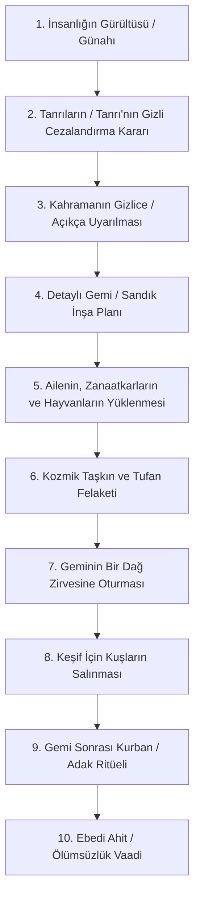

# Tufan Protokolü: Karşılaştırmalı Mezopotamya ve İbrahimî Tufan Analizi

## Tanım ve Yapısal Şema

"Tufan Protokolü", antik Yakın Doğu literatüründeki tufan mitlerinin tamamında şaşmaz bir sıra ile tekrarlanan **10 aşamalı edebi ve yapısal adımları** ifade eder. Bu adımlar, Mezopotamya'nın politeist Sümer tabletlerinden başlayarak Samiri/İbrani teolojisinin süzgecinden geçmiş ve nihayetinde İslamiyet'in Kur'anî anlatısına kadar ulaşan ortak bir iskelet sunar.

---

## 10 Aşamalı Tufan Protokolü Ayrıntıları

### 1. İnsanlığın Çoğalması ve İlahi Huzursuzluk
- **Atrahasis / Gılgamış:** İnsanlık aşırı çoğalmış, yeryüzü kalabalıklaşmış ve çıkardıkları gürültü panteonun başı Enlil'in uykusunu kaçırmıştır. Tanrılar keyfi olarak insanlığı yok etmeye karar verir.
- **Tevrat / Kur'an:** İnsanlık yeryüzünde çoğalmış ancak kötülük, ahlaksızlık, şiddet ve putperestlik baş göstermiştir. Tanrı, insanlığın ahlaki yozlaşması nedeniyle derin bir keder ve öfke duyar; ceza etik bir yargıdır.

### 2. Gizli Konsey Kararı ve Yemin
- **Atrahasis:** Enlil panteon meclisini toplar, insanlığı sessizliğe kavuşturmak için tufan kararı aldırır ve hiçbir tanrının insanlara bunu haber vermemesi için yemin ettirir.
- **Tevrat / Kur'an:** Karar bizzat tek Tanrı'nın kendi mutlak iradesinin, adaleti ve merhameti arasındaki dengenin sonucudur; gizli bir konsey veya yemin yoktur.

### 3. Kahramanın Uyarılması ve Gizlilik
- **Atrahasis / Gılgamış:** Bilgelik ve Su Tanrısı Ea (Enki), yeminine sadık kalmak adına kahraman Atrahasis'e (veya Utnapiştim'e) doğrudan seslenmez. Bunun yerine onun kamıştan yapılmış kulübesinin duvarına (*kikkišu*) konuşur: *"Kamış duvar, dinle! Duvar, iyi anla! Şuruppaklı adam, evini yık, bir gemi yap!"* Ea böylece yeminini delmeden insanlığı kurtarır.
- **Tevrat / Kur'an:** Tanrı, Nuh peygamber ile doğrudan, açık ve net bir şekilde konuşarak onu yaklaşan felaket konusunda uyarır. Herhangi bir hile veya gizlilik yoktur.

### 4. Gemi İnşa Planı ve Geometri
- **Gılgamış Tab. XI:** Ea geminin ölçülerini tam bir küp olacak şekilde verir. Genişliği, boyu ve yüksekliği eşit (120 arşın), 6 güverte ile 7 katlı, 9 bölmeli devasa kare bir kutu.
- **Tevrat (Yaratılış 6):** Tanrı Nuh'a dikdörtgen şeklinde bir sandık (*tebah*) yapmasını söyler. Boyu 300 arşın, eni 50 arşın, yüksekliği 30 arşın, 3 katlı ve ziftle sıvanmış.
- **Kur'an (Kamer 13):** Gemiden *"Levhalar ve çivilerle yapılmış bir gemi"* (*zâti elvâhın ve dusur*) olarak bahsedilir.

### 5. Gemiye Biniş ve Kurtulanlar
- **Gılgamış Tab. XI:** Utnapiştim gemiye kendi ailesini, akrabalarını, her türlü kır hayvanını ve en önemlisi **ustaları ve zanaatkarları** (medeniyetin ve teknolojinin devamı için) bindirir.
- **Tevrat / Kur'an:** Nuh, ailesi, iman eden az sayıda insan ve her canlı türünden birer (veya temiz hayvanlardan yedişer) çift gemiye alınır. Zanaatkar vurgusu yoktur; odak ahlaki kurtuluştur.

### 6. Kozmik Taşkın ve Tufan Felaketi
- **Gılgamış Tab. XI:** Tufan 6 gün 7 gece sürer. Fırtına o kadar korkunçtur ki tanrılar bile korkudan Anu'nun göğüne kaçar ve duvar diplerine köpekler gibi büzüşürler.
- **Tevrat (Yaratılış 7):** Tufan göklerin pencerelerinin açılması ve derinliklerin kaynaklarının fışkırmasıyla başlar; 40 gün 40 gece yağmur yağar, suların çekilmesi 150 gün sürer.
- **Kur'an (Hud 40):** Tufanın başlama alameti olarak *"tannur fışkırdı / kaynadı"* (*fâret-tennûr*) ifadesi kullanılır (tannur: ekmek fırını veya yeraltı lav/su kaynağı).

### 7. Dağ Zirvesine Oturma
- **Gılgamış Tab. XI:** Gemi **Nisir Dağı**'na (modern Irak/İran sınırındaki Nimush Dağı) oturur.
- **Tevrat (Yaratılış 8):** Gemi **Ararat Dağları**'na (Doğu Anadolu / Ermenistan yaylası) oturur.
- **Kur'an (Hud 44):** Gemi **Cudi Dağı**'na (Şırnak/Cizre bölgesi) oturur.

### 8. Keşif İçin Kuşların Salınması
- **Gılgamış Tab. XI:** Utnapiştim sırasıyla bir **güvercin** (yer bulamayıp döner), bir **kırlangıç** (yer bulamayıp döner) ve bir **karga** (suların çekildiğini görüp leş yer, dönmez) salar.
- **Tevrat (Yaratılış 8):** Nuh önce bir **karga** salar (git-gel yapar), ardından bir **güvercin** salar (döner), yedi gün sonra güvercini tekrar salar (ağzında zeytin yaprağıyla döner), yedi gün sonra yine salar (bu kez dönmez).

### 9. Gemi Sonrası Kurban ve Tanrıların Reaksiyonu
- **Gılgamış Tab. XI:** Utnapiştim gemiden iner inmez kurban keser, tütsü yakar. Tufan boyunca aç kalan tanrılar, kurbanın tatlı kokusunu alınca sununun etrafına **sinekler gibi üşüşürler**. Enlil kurbanı görünce Atrahasis'i kurtardığı için Ea'ya öfkelenir.
- **Tevrat (Yaratılış 8):** Nuh temiz hayvanlardan Tanrı'ya yakmalık sunular sunar. YHWH sununun hoş kokusunu alır ve kendi kendine: *"İnsan yüzünden yeryüzünü bir daha asla lanetlemeyeceğim"* der.

### 10. Ebedi Ahit ve Sonuç
- **Gılgamış Tab. XI:** Enlil öfkesini yatıştırır, Utnapiştim ve karısını kutsar, onlara **ölümsüzlük vaat ederek** nehirlerin kaynağında (cennette) yaşamaları için uzağa yerleştirir.
- **Tevrat (Yaratılış 9):** Tanrı Nuh ve oğullarını kutsar, çoğalmalarını söyler ve insanlıkla bir daha tufan göndermeyeceğine dair **Gökkuşağı Ahdi**'ni kurar.
- **Kur'an (Nuh 26-28):** Nuh'un duasının ardından yeryüzü yeniden imar edilir, inananlar yeni bir ahlaki topluluk kurar.

---

## Karşılaştırmalı Tufan Parametreleri Tablosu

| Parametre | Sümer (Ziusudra) | Akkad (Atrahasis) | Babil (Gılgamış XI) | Tevrat (Bereshit) | Kur'an (Hud/Nuh) |
|-----------|------------------|───────────────────|─────────────────────|───────────────────|──────────────────|
| **Cezalandırma Sebebi** | Belirsiz (Tanrıların kararı) | İnsanlığın gürültüsü, uykusuzluk | Belirsiz / Enlil'in öfkesi | Ahlaki yozlaşma, günah | Şirk (putperestlik), zulüm |
| **Gemi Geometrisi** | Dev bir tekne (*má-gur-gur*) | Kare / Silindirik | Küp (60x60x60 metre) | Dikdörtgen Prizma | Levhalar ve çiviler |
| **Tufan Süresi** | 7 gün 7 gece | 7 gün 7 gece | 6 gün 7 gece | 40 gün / 150 gün | Belirsiz (uzun süre) |
| **Gemiye Binenler** | Ziusudra ve ailesi | Atrahasis, ailesi, ustalar | Utnapiştim, aile, zanaatkarlar | Nuh, eşi, oğulları ve gelinleri | Nuh, ailesi, inananlar |
| **Salınan Kuşlar** | Belirtilmemiş | Belirtilmemiş | Güvercin, Kırlangıç, Karga | Karga, Güvercin (zeytin dalı) | Belirtilmemiş |
| **İniş Dağı** | Cennet (Dilmun) | Belirtilmemiş | Nisir / Nimush Dağı | Ararat Dağları | Cudi Dağı |
| **Ödül / Sonuç** | Ölümsüzlük | İnsan nüfus kontrolü yasaları | Ölümsüzlük (cennette yaşam) | Gökkuşağı Antlaşması | Yeni ahlaki düzen, esenlik |

## Kaynaklar

- Lambert, Wilfred G. and Millard, Alan R. *Atrahasis: The Babylonian Story of the Flood*. Eisenbrauns, 1999.
- George, Andrew R. *The Babylonian Gilgamesh Epic: Introduction, Critical Edition and Cuneiform Texts*. Oxford University Press, 2003.
- Bailey, Lloyd R. *Noah: The Person and the Story in History and Tradition*. University of South Carolina Press, 1989.
